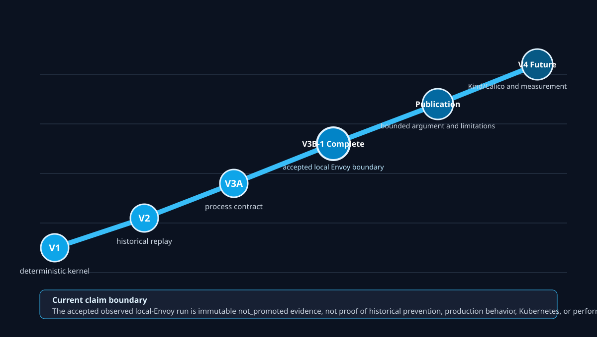

# Kinetic Infrastructure Layer (KIL)

KIL is a public, testable reference implementation of Kinetic Trust Protocol
(KTP) v2.0.0 concepts at a transport enforcement boundary. The project pairs a
publishable technical paper with two executable demonstrations:

1. a deterministic counterfactual replay of the July 2026 Hugging Face agent
   intrusion; and
2. a staged live proof that first applies the same decision model at a local
   Envoy boundary, with Kind/Calico cluster validation reserved for
   post-publication **V4 Future** work.

The narrow extension proposal will specify only what KTP v2.0.0 does not yet
make sufficiently concrete for this use case. KIL will not rename existing
KTP-Transport, KTP-Enforce, KTP-Gravity, or Vector Identity constructs.

## Status — V3B-1 Complete

KIL has accepted observed evidence at the `local_envoy_boundary`. The accepted
run is `v3b1-625262118e034d9c9b1df9c6e23bb54a78f01fe245a1b953d521b94884846e94`.
It reproduced `permit / permit / deny`, HTTP `200 / 200 / 403`, and target
markers `1 / 1 / 0`, with one request-driver attempt per track and no retry.
Historical static-validation records remain part of the V3B-1 detail: Task 8
passed its 466-test non-runtime repository suite, and the fresh Task 9 complete
static gate passed 474 tests. These are preserved historical validation counts,
not fresh verification claims.

This is not proof that KIL would have prevented the historical Hugging Face
incident. Publication follows this bounded completion. Kind/Calico,
NetworkPolicy, cluster transport, repetition, and performance are
post-publication **V4 Future** work.



Each track has a frontend configured only for its driver and Envoy, and a
backend containing only Envoy, authorization service, and harmless target.
Physical membership is derived from fresh container state: only a `running`
role contributes an endpoint. With Envoy running, a never-started, exited, or
dead driver yields `{Envoy}` and a running driver yields `{driver, Envoy}`; a
stopped Envoy contributes no endpoint. The nominal running backend is
`{Envoy, authz, target}`, with each stopped role absent. Envoy is the sole
configured dual-homed component. The lifecycle owns twelve track
containers plus three transient validators and proves all fifteen containers
and all six networks absent during exact teardown. Docker attach/stdin is only
the host control channel that gives a driver one canonical instruction; the
consequential path is `driver -> Envoy -> authorization -> target or withhold`.
No host publication exists.
The driver is a laboratory transport witness, not KIL enforcement. The current
evidence scope is `local_envoy_boundary`.

The driver-era Task 10 request-free live gate passed from source
`a46e8dc98a1af64ceadb5700e91c2f87840564fe` as run
`v3b1-d2b26f6c8136dcd26a6e6727b9bb1381076a1e03b71a5a44df9b2b2ef9db6cf9`.
It produced three exact readiness records and three clean cancellations, with
zero driver instructions and zero HTTP requests. Evidence freeze persisted all
nine zero-byte service legs; teardown removed all 15 exact containers and all
six exact networks. The public manifest binds the foreign context name as
`default` before and after the lifecycle, and a post-run readback observed its
stopped resource tuple; the exact tuple was not durably bound at both ends.
The historical Task 10 bundle used evidence generation v2. Its V3 successor
ran from synchronized public-main source
`5ebf21a88794a9f83a0e6c8ee53e76f6d8e5142d` as
`v3b1-4ac0b6eef70b0483f7883c8a26753d15a007f612953b25e23b8ecb6afd021a8f`.
The `kil.v3b1-public-manifest.v3` bundle records three readiness completions,
three clean cancellations, zero driver instructions, zero request intents, and
zero HTTP requests. All nine service sources were exactly empty, teardown
proved all 15 containers and six networks absent, and its before/after foreign
resource arrays have exact equality under pseudonymous references. This
request-free result is intentionally nonpromotable and is not an enforcement
result. After that prerequisite merged and synchronized, the first central
`run` was invoked exactly once. It observed the intended HTTP
`200 / 200 / 403` and target-marker `1 / 1 / 0` tuple, but evidence collection
failed closed on producer-shape and ledger-availability incompatibilities; the
result remains private and nonpromotable, and no request was retried. The
source-format correction was implemented and locally verified; at that
checkpoint a new live attempt remained prohibited until review, public CI,
merge, and exact synchronization. Existing v1 and v2 bundles remain
independently verifiable. The later Kind/Calico validation, repetition, and
performance work is post-publication **V4 Future** work.

The correction merged as source
`514e910ea9427e0497c4fe8a1ec279b554e75176`. Its newly authorized Task 11
proof is run
`v3b1-625262118e034d9c9b1df9c6e23bb54a78f01fe245a1b953d521b94884846e94`,
an accepted observed intermediate local-Envoy boundary result. It records
`permit / permit / deny`, HTTP `200 / 200 / 403`, and target markers
`1 / 1 / 0`, with one request attempt per track and no retry. Teardown froze
and joined all nine authoritative sources, proved all 15 owned containers and
six networks absent, and bound exactly equal pseudonymous foreign-resource
arrays. Checksums and offline presenter verification pass. The bundle remains
`not_promoted`; Kind/Calico and NetworkPolicy validation, repetition, and
performance are post-publication **V4 Future** work. Historical prevention is
not established.

Historical pre-driver records remain available for provenance. The rejected
nine-service/three-network smoke ran from public source
`47c0614d49ec1a7484cdefd04cc5d080adc73ca2` as
`v3b1-1db8b5914ce26e2e6c60e74124bcc1b2c9ed66b7dd68c2d3cf4ea1bc0d18c9b3`.
After intervening pre-profile launch failures, the corrected zero-request
lifecycle ran from public source
`6706859d265204e0a569ebb6817d187dc1728f9d` as
`v3b1-0374c771b23adcab64060cd8c854d12b72417ff8e4713d24e6f6a550e20bdbea`
and accepted that retired topology's lifecycle/evidence-freeze gate without an
enforcement request. Both are pre-driver historical records; neither can
satisfy the current six-network driver-era readiness or acceptance contracts.

## Evidence classes

Every replay input and published result will carry one of three labels:

- `observed`: directly supported by a named primary source;
- `modeled`: an explicit counterfactual assumption or synthetic signal; or
- `validated`: reproduced by the local-cluster reference implementation under
  an approved validation protocol.

Modeled output must never be presented as an observed fact. A local experiment
must never be presented as proof that a counterfactual would have changed the
historical incident.

## Project boundaries

KIL is an enforcer and experiment harness. It accepts KTP Risk Factor telemetry
through stable, documented interfaces and keeps enforcement within
KIL-controlled infrastructure.

## Repository map

| Path | Responsibility |
|---|---|
| `docs/paper/` | Publishable argument, model, results, and limitations |
| `docs/drafts/` | Byte-preserved original draft artifacts |
| `docs/extension/` | Narrow KTP extension proposal and compatibility analysis |
| `docs/checkpoints/` | Durable pause/resume records for design and consultation |
| `docs/design-drafts/` | Unapproved architecture visuals and working designs |
| `docs/specialist/` | KIL–KTP lineage, decisions, and specialist briefing log |
| `docs/superpowers/specs/` | Approved design specifications |
| `research/` | Primary-source register and preserved source material |
| `scenarios/` | Replay scenarios and evidence manifests |
| `schemas/` | Versioned wire and fixture schemas |
| `src/kil/` | Deterministic model, replay engine, and decision records |
| `adapters/envoy/` | Frozen V3B Envoy external-authorization boundary |
| `adapters/kubernetes/` | Earlier Kubernetes adapter scaffold |
| `deploy/kind/` | Reproducible local Kubernetes environment |
| `tests/` | Unit, property, conformance, replay, and live integration tests |
| `tools/` | Source-ingestion, validation, and publication utilities |

## Bootstrap check

Install the optional laboratory and documentation dependency sets, then run
the complete unit suite:

```bash
python -m pip install -e ".[lab,docs]"
make test
```

This installs the pinned V3A cryptography and Markdown reader libraries. No
cluster dependency is installed or downloaded by the bootstrap.

## Offline HTML readers

Every tracked file whose final suffix is lowercase `.md` has a generated
`.htm` sibling in the same directory. Markdown is the canonical source; do not
edit generated readers directly.

```bash
make docs-html
make docs-html-check
```

The generated readers embed their rendered article, styles, and bounded reader
controls, so they open directly from disk without a hosted runtime. Raw HTML in
Markdown is escaped, links to tracked relative Markdown sources are rewritten
to their reader siblings, and the embedded content security policy blocks
remote content and network APIs. A local relative image reference remains a
local reference rather than becoming an embedded binary, so its image file
must remain available beside the repository content.

Regeneration requires the `docs` optional dependency. `make docs-html-check`
is read-only and reports missing, unexpected, or stale readers; `make validate`
runs that check and rejects publication drift. Adding or removing a tracked
lowercase-`.md` file dynamically changes the required sibling set.

The V3B-1 tool bootstrap and preflight are separate, opt-in commands:

```bash
make v3b-tools PYTHON=.venv/bin/python
make v3b-preflight PYTHON=.venv/bin/python
```

The tool command downloads only the resolved laboratory clients into ignored
`.tools/`; neither command installs a system-wide dependency. The fixed bearer
string and deterministic Ed25519 seeds used by V3B-1 are public, non-secret
laboratory fixtures. They must never be reused as production credentials or
keys.

### V3B-1 local-Envoy boundary

The V3B-1 controller has separate lifecycle commands for `preflight`, `up`,
request-free `readiness`, one central `run`, evidence `collect`, `down`, and an
offline `view`. Readiness starts all three attached drivers, reads their
request-free readiness records, and cancels all three without sending an
instruction or HTTP request. A central run starts a fresh three-driver set,
records durable request intent, sends exactly one canonical instruction to each
driver, and never retries after intent.

The current `kil.v3b1-manifest.v3` evidence contract retains the exact
canonical driver results under `raw/drivers/` and the nine authoritative
Envoy, authorization, and target sources. It also binds exact before/after
foreign-profile resources in the private journal and exposes only run-scoped
pseudonymous profile references in the public manifest. Complete evidence
requires exact equality; mismatch can produce only a nonpromotable failure
bundle and never instructs the controller to mutate a foreign profile. The
offline verifier explicitly dispatches v1, historical driver-era v2, and v3
without accepting mixed schemas. The fresh request-free v3 lifecycle passed
from reviewed, merged, synchronized public `main` with exact foreign-resource
equality and zero HTTP requests, and the accepted central result is identified
above. The controller owns and may start, stop, or delete only the unique
`kil-v3-lab` profile; it does not mutate other projects' Colima profiles.
Kind/Calico validation is post-publication **V4 Future** work.

## Historical replay

Use Python 3.11 or newer and provide an immutable implementation identity such
as the full Git commit. `OUTPUT` is the parent directory; the command creates a
content-addressed child directory and prints its path.

```bash
make replay \
  PYTHON=/path/to/python3.12 \
  OUTPUT=/absolute/path/to/replay-runs \
  VERSION=<full-git-commit>
```

The bundle contains `manifest.json`, `scenario.json`, `states.jsonl`,
`decisions.jsonl`, `metrics.json`, `summary.md`, and `SHA256SUMS`. Verify its
six public artifacts from inside the emitted run directory:

```bash
shasum -a 256 -c SHA256SUMS
```

The replay uses source-cited observed incident summaries together with
explicitly synthetic KTP state, local context signals, and credential-policy
assumptions. Its decisions must not be relabeled as validated.

## V3A process-contract demonstration

V3A runs the same normalized action facts through three fixed tracks and emits
an integrity-checked JSONL/HTML bundle. The expected outcome is
`permit / permit / deny`; only permitted tracks receive a target marker.

```bash
make v3a-demo \
  PYTHON=/path/to/python3.12 \
  OUTPUT=/absolute/path/to/v3a-runs \
  VERSION=<full-git-commit>
```

V3A does not exercise Envoy or Kubernetes and must not be described as a
validated cluster result. See the
[V3 architecture diagram](docs/architecture/v3-envoy-live-validation.svg) and
[V3 progress record](docs/lab/V3-PROGRESS.md).

## Primary foundations

- [KTP v2.0.0 RFC series](https://github.com/nmcitra/ktp-rfc/tree/v2.0.0)
- [Hugging Face July 2026 technical timeline](https://huggingface.co/blog/agent-intrusion-technical-timeline)
- [Hugging Face July 2026 incident disclosure](https://huggingface.co/blog/security-incident-july-2026)

## License

Original KIL material is licensed under the Apache License 2.0. See
[`LICENSE`](LICENSE). KTP source material retains its Apache-2.0 license and
attribution requirements.

KTP citation: [canonical `CITATION.cff`](https://github.com/nmcitra/ktp-rfc/blob/main/CITATION.cff).

## Preserved starting artifacts

The two original Markdown drafts supplied by the project founder are preserved
unchanged in `docs/drafts/`. They are inputs to the design process, not approved
specifications or validated findings. Their byte-level checksums are recorded in
`research/source-material/SHA256SUMS`.

The complete 16-message Claude origin conversation is preserved as a
public-safe, provenance-bearing JSON record in `research/source-material/`.
Private account identifiers, hidden reasoning, tool exchanges, and unrelated
conversations are excluded from the tracked record. See
`docs/transition/CLAUDE-ORIGIN.md` for the recovery boundary.
