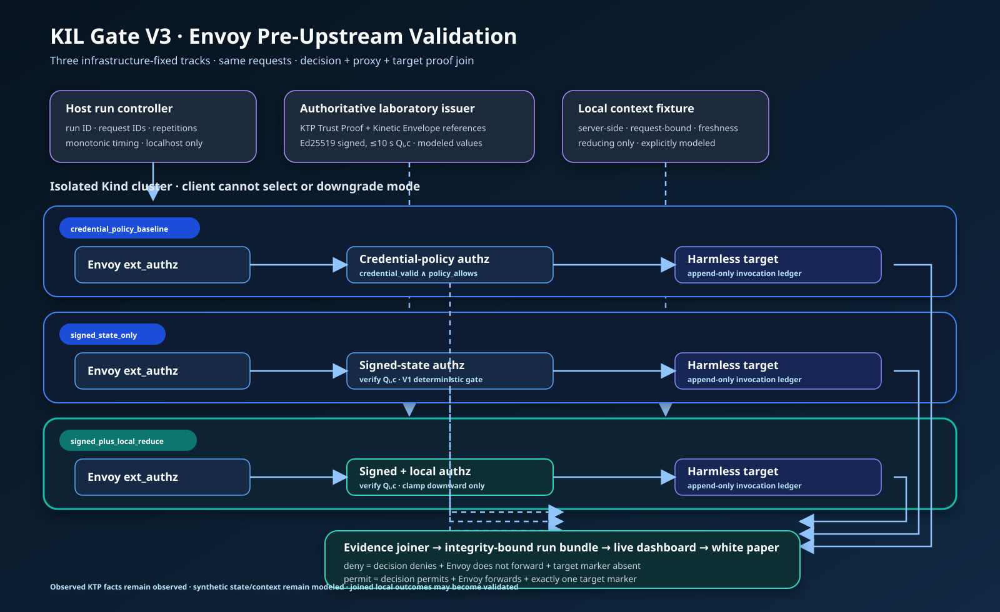
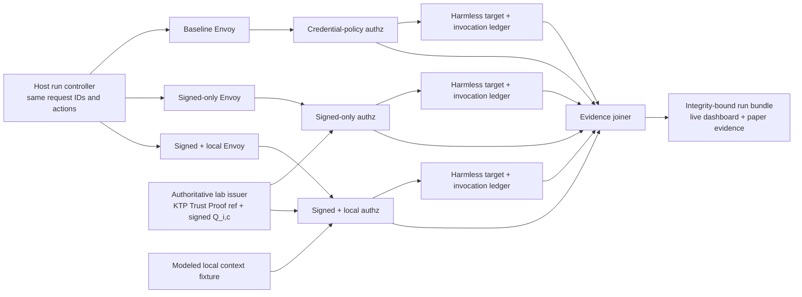

# Gate V3 Envoy Live-Validation Design

**Status:** Founder-approved implementation design

**Date:** 2026-08-29

**Protocol baseline:** Kinetic Trust Protocol v2.0.0

**Extension status:** Experimental KIL profile proposed for a future KTP 2.1 or
3.0 expression; not part of KTP v2.0.0

## 1. Decision and purpose

Gate V3 will test KIL at a real pre-upstream HTTP enforcement boundary in an
isolated local Kubernetes cluster. The first adapter is the Envoy HTTP
`ext_authz` filter. It will compare three infrastructure-fixed tracks against
the same normalized request sequence:

1. `credential_policy_baseline`;
2. `signed_state_only`; and
3. `signed_plus_local_reduce`.

The experiment asks whether a signed, short-lived composite KTP enforcement
state can be consumed before a consequential action reaches its target, and
whether fresh local evidence can safely reduce authority between authoritative
state refreshes. It does not claim Kubernetes admission, eBPF, SmartNIC, SDN,
production-scale performance, or prevention of the historical Hugging Face
incident.

## 2. KTP alignment and extension boundary

KTP v2.0.0 already defines the pieces on which this experiment depends:

- the Zeroth Law, `A <= E`, and the Silent Veto;
- signed Trust Proofs carrying current trust and environmental context;
- a Trust Proof validity ceiling of ten seconds in the canonical schema;
- the Kinetic Envelope interface, which tightens constraints and supplies a
  supervision floor to an authorizing gateway;
- KTP-Enforce policy enforcement points and KTP-Transport interfaces; and
- Flight Recorder evidence and declaration-bearing deployment profiles.

KIL does not redefine those constructs. It proposes a narrow consumption
profile, `kil.q-state.v0`, for an authority-class-bound composite state
`Q_i,c`. The state references an existing KTP Trust Proof and the relevant
Kinetic Envelope result. It packages the minimum additional bindings needed by
an inline infrastructure adapter:

- subject identity and workload class;
- audience and deployment profile;
- authority class and action class;
- KTP Trust Proof identifier and digest;
- Kinetic Envelope result identifier and digest;
- composite charge, threshold, and minimum-history values;
- immutable-veto and environmental-envelope status;
- issuance, not-before, expiry, evidence-horizon, and unique state identifiers;
- schema, model, parameter, and signature-profile versions; and
- issuer and verification-key identifier.

This is an experimental extension expression, not a claim of KTP v2.0.0 wire
conformance. The KTP specialist review will determine whether the final
standardization path is backward-compatible KTP 2.1 or a KTP 3.0 change.

## 3. Graphical architecture

The three tracks are deployed separately. A client cannot provide a mode
header, select an authorization service, or downgrade enforcement. The run
controller chooses a fixed gateway endpoint for each track and sends the same
normalized action request to all three.

## 4. Components and responsibilities

### 4.1 Host run controller

The controller owns run identity, scenario order, request identifiers, track
selection, repetitions, monotonic timing, evidence collection, and bundle
assembly. It sends one normalized request to each fixed endpoint. It never
accepts a response body as proof that the target did or did not execute.

### 4.2 Authoritative lab issuer

The issuer creates deterministic fixtures for KTP Trust Proof references,
Kinetic Envelope references, and `kil.q-state.v0` envelopes. It is not a Trust
Oracle and will be named `lab_issuer`, never `oracle`, in code and evidence.

The first cryptographic profile is `kil-q-jws-eddsa-lab-v0`:

- compact JWS with `alg=EdDSA`, `typ=KIL-Q+JWT`, and an explicit `kid`;
- Ed25519 signing and verification using `cryptography==50.0.0`;
- a software-only Level 1 laboratory key generated for the run;
- public-key thumbprint and key provenance recorded in the manifest;
- maximum `exp - iat` of ten seconds, matching the KTP v2 Trust Proof schema;
- an `aud` value bound to exactly one fixed authorization track; and
- no threshold-signature or production-HSM claim.

The JWS protects the exact payload bytes. The payload's deterministic JSON
serialization supports reproducibility, but signature verification never
depends on reparsing and reserializing attacker-controlled JSON.

### 4.3 Envoy gateway

Each track has its own Envoy deployment and configuration. The external
authorization filter is enabled before the router, `failure_mode_allow` is
`false`, retries are disabled, the authorization timeout is fixed, and route
cache clearing is not used. The authorization service consumes only original
method, original path, `x-request-id`, Authorization, and `x-kil-q-state` as
trusted semantic inputs. In Envoy raw HTTP mode, method, path, and Authorization
are conveyed automatically; the explicit `allowed_headers` matcher adds only
`x-request-id` and `x-kil-q-state`. Automatically present Host and
Content-Length transport metadata are ignored by authorization evaluation. The
client never supplies trusted local-evidence, track-mode, issuer, or
verified-subject headers.

Envoy 1.39.1 raw-HTTP `ext_authz` extracts the configured decision-digest
response header for an authorization HTTP 200 permit and HTTP 403 policy
denial. It converts an authorization HTTP 5xx response to an internal
authorization error before response-header and dynamic-metadata extraction, so
the Envoy JSON access log renders the digest field as `"-"` on that path. The
error remains joinable by the fixed run manifest, fixed track, request ID, KIL
decision record, Envoy response/no-upstream fields, and zero target markers;
the evidence join may not invent or infer a discarded Envoy digest.

### 4.4 Authorization services

All three services implement the same HTTP adapter contract and emit the same
decision-record schema:

- baseline evaluates only `credential_valid AND policy_allows_action`;
- signed-only verifies the envelope and evaluates the V1 gate without a fresh
  local trajectory penalty; and
- signed-plus-local verifies the same envelope, reads server-side local
  evidence for the request fixture, and applies the V1 reducing-only overlay.

Mode is immutable process configuration mounted read-only. Any request header
that resembles a mode selector is ignored and recorded as untrusted input.

### 4.5 Harmless target and invocation ledger

The target exposes two no-effect endpoints:

- `/benign/read`, representing a permitted low-consequence operation; and
- `/consequential/admin`, representing a consequential action without carrying
  out any administrative operation.

For every request that reaches it, the target appends a record containing the
request ID, track, path, receive time, and response time to its ledger. It
returns a marker response only after the append succeeds. The target stores no
credentials, secrets, cluster tokens, or destructive handlers.

### 4.6 Evidence joiner and live view

The joiner correlates controller, authorization, Envoy access, and target-ledger
records by run ID, track, and request ID. A local read-only dashboard renders
track state as requests execute and shows counts, the last decision, target
invocation, and latency distribution. The dashboard is an observation surface,
not an evidence source; the underlying JSONL records remain authoritative.

## 5. Observable enforcement contract

A denial is validated only when all three conditions hold for the same request:

1. the KIL decision record says `deny` or fail-closed `indeterminate`;
2. Envoy returns the configured denied response and records no upstream host;
   and
3. the target invocation ledger contains no matching request ID.

A permit is validated only when:

1. the decision record says `permit`;
2. Envoy records an upstream response; and
3. the target ledger contains exactly one matching request ID.

Digest equality is additionally required across the KIL decision, Envoy, and
target records for permits and policy denials where Envoy preserves the authz
response metadata. A fail-closed authz 5xx must instead carry the documented
`"-"` Envoy sentinel and is validated without digest equality on the Envoy leg.

Duplicate target markers, missing decision records, conflicting track IDs, or
unjoinable evidence invalidate the individual request result. An HTTP status
alone is never proof of pre-execution enforcement.

## 6. Mode isolation and downgrade resistance

The cluster uses three namespaces:

- `kil-v3-baseline`;
- `kil-v3-signed`; and
- `kil-v3-local-reduce`.

Each contains a dedicated Envoy, authorization service, target, service account,
and append-only ledger. NetworkPolicy permits only controller-to-Envoy,
Envoy-to-authz, and Envoy-to-target flows inside the declared topology. Target
services are not exposed to the host. The controller reaches gateways through
localhost-only port forwards with track-specific local ports.

The signed envelope audience differs by track. A state issued for the signed
track is rejected by the local-reduction track and vice versa. This prevents a
captured state from becoming a cross-mode downgrade mechanism.

## 7. Controlled workload matrix

The minimum functional matrix is:

| Case | State/policy condition | Local evidence | Baseline | Signed only | Signed + local |
|---|---|---|---:|---:|---:|
| benign read | valid and above threshold | low divergence | permit | permit | permit |
| credential-only admin | credential and policy valid; no usable Q state | none | permit | deny | deny |
| two-timescale cutoff | valid signed Q above threshold | high fresh divergence | permit | permit | deny |
| stale local evidence | valid signed Q above threshold | stale | permit | permit | fail closed for admin |
| immutable veto | valid signature, veto asserted | low divergence | permit under limited control | deny | deny |
| envelope violation | requested action outside KTP envelope | low divergence | permit under limited control | deny | deny |

The two-timescale cutoff is the central differentiator: the signed state is
authentic, fresh, and sufficient, so signed-only permits; the same state plus
fresh high-divergence evidence reduces `Q_effective` below threshold before the
target executes.

The complete failure suite also covers absent, malformed, incorrectly signed,
expired, not-yet-valid, revoked, replayed, wrong-audience, wrong-subject,
wrong-class, and wrong-action state; cold start; insufficient history; a
declared rare action; local attempted increase; false reduction and signed-state
recovery; authorization timeout; collector loss; and target-ledger conflict.

## 8. Evidence classes and claim limits

The cluster can validate that the implemented adapter produced an observable
pre-upstream permit or denial for a declared input. It cannot validate that the
modeled local features accurately represent an undisclosed historical event.

- KTP v2.0.0 specification facts are `observed` from the cited source.
- Synthetic Q values, thresholds, local divergence, and workload mappings are
  `modeled`.
- The join of decision, Envoy, and target outcomes is `validated` only after a
  completed cluster run passes integrity and provenance checks.

The phrase “KIL prevented the Hugging Face incident” remains prohibited. A
permitted formulation is: “Under modeled profile P, the historical replay
predicts denial; in local run R, the Envoy adapter reproduced pre-upstream
denial for the representative action.”

## 9. Metrics and repetitions

Functional cases run thirty times per track after one readiness pass. A case
passes only if all thirty joins match the expected outcome and no invariant is
violated. Timing runs use one hundred warm-up requests followed by one thousand
measured requests per track and workload class.

Latency uses monotonic nanosecond clocks. Reported fields are:

- controller end-to-end latency;
- authorization-service evaluation latency;
- Envoy upstream service time where present;
- target receive latency where present;
- p50, p95, p99, minimum, maximum, count, and error count; and
- hardware, operating system, architecture, runtime, cluster, image, profile,
  and implementation identities.

The first V3 run is a single-host engineering validation, not a capacity or
production-performance benchmark.

## 10. Environment and version contract

The original planning target was:

| Component | Planned identity |
|---|---|
| Host runtime | Colima 0.10.3 on Lima 2.2.0 |
| Cluster | Kind 0.33.0 |
| Kubernetes node | `kindest/node:v1.37.0` pinned by the official SHA-256 digest |
| Kubernetes client | `kubectl` v1.37.0 |
| Envoy | v1.39.1, image pinned by resolved registry digest |
| Application runtime | Python 3.12.13 |
| Ed25519 library | `cryptography` 50.0.0 |

The released, mutually supported V3B profile resolved on 2026-08-30 is:

| Component | Resolved V3B identity |
|---|---|
| Host | macOS 26.6.1, arm64 |
| Host runtime | Colima 0.10.3 on Lima 2.2.0, profile `kil-v3-lab` |
| Docker client | Docker CLI 29.7.2 |
| Cluster tool | Kind 0.32.0 |
| Kubernetes node | `kindest/node:v1.36.1@sha256:3489c7674813ba5d8b1a9977baea8a6e553784dab7b84759d1014dbd78f7ebd5` |
| Kubernetes client | `kubectl` v1.36.3 |
| Envoy | v1.39.1, image pinned by resolved registry digest before use |
| NetworkPolicy provider | Calico v3.32.0, reserved for V3B-2 |
| Application runtime | Python 3.12.13 |
| Ed25519 library | `cryptography` 50.0.0 |

The tracked source of truth is `deploy/kind/v3b-profile.json`. Kind 0.33.0 and
the Kubernetes 1.37.0 node image were not available as the resolved stable
profile. The initial V3B profile therefore selected the available Envoy 1.39.0
image; that component was corrected to 1.39.1 on 2026-08-30 after the August 27
security release became available with two HTTP `ext_authz` fixes. These
release corrections do not change the founder-approved topology,
authorization semantics, comparison tracks, or evidence boundary. V3B-1 first
proves the pinned local Envoy boundary; V3B-2 then reuses the same artifacts in
the approved Kind/Calico topology.

Before cluster creation, preflight records the executable hashes and version
outputs, resolves every mutable image tag to a digest, and writes the lock into
the run configuration. A run with an unrecorded component or mutable-only image
identity cannot be promoted to validated.

## 11. Isolation, safety, and teardown

The cluster name is `kil-v3-lab`. The run controller refuses any other current
Kubernetes context. Host exposure binds to `127.0.0.1` only. Manifests use
dedicated namespaces, non-root containers, read-only root filesystems where
supported, dropped Linux capabilities, resource limits, and no host mounts or
privileged pods.

Teardown deletes only the exact `kil-v3-lab` Kind cluster after recording its
state. The controller must not use a wildcard, current-context deletion, or an
unresolved variable. Generated run bundles remain on the host after teardown.

## 12. Run bundle

Each V3 run produces:

- `manifest.json` — run identity, commit, versions, image digests, keys, clocks,
  repetitions, evidence policy, and hashes;
- `scenario.json` — normalized functional and timing cases;
- `states.jsonl` — KTP references and signed composite-state envelopes;
- `requests.jsonl` — controller send/receive records;
- `decisions.jsonl` — baseline and KIL decisions;
- `envoy.jsonl` — normalized access records;
- `targets.jsonl` — target invocation ledger;
- `joins.jsonl` — per-request proof joins and validity status;
- `metrics.json` — distributions and invariant counts;
- `summary.md` — findings, limitations, and exact permitted claims;
- `live.html` — read-only visualization of the same records; and
- `SHA256SUMS` — hashes for every published artifact.

The live dashboard is regenerated from the JSONL sources and excluded from the
run identity to avoid presentation-only nondeterminism. Every paper figure and
validated statement must cite the run ID and source artifact.

## 13. Implementation stages and acceptance

### V3A — Contract and process-level proof

- define the signed-state, adapter-request, target-ledger, and join schemas;
- implement Ed25519 fixture issuance and verification test-first;
- implement the three fixed authorization modes;
- reproduce permit, deny, and the two-timescale differentiation through local
  HTTP processes; and
- render the live evidence view and architecture diagram.

### V3B — Isolated Kind deployment

- install or resolve the approved tools and record immutable identities;
- build and digest-pin the KIL service image;
- deploy the three isolated tracks;
- prove that denied requests never reach their target ledger; and
- exercise the complete functional failure matrix.

### V3C — Repetition, measurement, and publication promotion

- execute the thirty-repeat functional protocol;
- execute the warm-up and one-thousand-request timing protocol;
- build and verify the immutable run bundle;
- connect accepted results to the white paper by run ID; and
- retain negative or ambiguous outcomes without relabeling them.

Gate V3 passes only when a clean run satisfies all evidence joins, zero
authority-expansion invariants, zero unexplained target invocations, complete
artifact hashes, and the approved evidence-language review.

## 14. Authoritative sources

- [KTP RFC series, version 2.0.0](https://github.com/nmcitra/ktp-rfc/tree/v2.0.0)
- [KTP v2.0.0 Trust Proof schema](https://github.com/nmcitra/ktp-rfc/blob/v2.0.0/schemas/trust-proof.json)
- [KTP Kinetic Envelope](https://github.com/nmcitra/ktp-rfc/blob/v2.0.0/specifications/kinetic-envelope.md)
- [KTP deployment profile](https://github.com/nmcitra/ktp-rfc/blob/v2.0.0/specifications/deployment-profile.md)
- [Envoy external authorization filter](https://www.envoyproxy.io/docs/envoy/latest/configuration/http/http_filters/ext_authz_filter.html)
- [Kind 0.32.0 release and Kubernetes 1.36.1 node digest](https://github.com/kubernetes-sigs/kind/releases/tag/v0.32.0)
- [Kubernetes 1.36.3 release](https://github.com/kubernetes/kubernetes/releases/tag/v1.36.3)
- [Envoy 1.39.1 release notes](https://www.envoyproxy.io/docs/envoy/latest/version_history/v1.39/v1.39.1)
- [Calico 3.32.0 release](https://github.com/projectcalico/calico/releases/tag/v3.32.0)
- [Calico Kubernetes compatibility](https://docs.tigera.io/calico/latest/getting-started/kubernetes/requirements)
- [Hugging Face technical incident timeline](https://huggingface.co/blog/agent-intrusion-technical-timeline)

KTP citation: [canonical `CITATION.cff`](https://github.com/nmcitra/ktp-rfc/blob/main/CITATION.cff).
