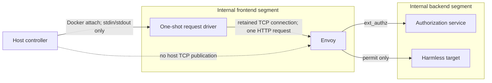

# V3B-1 In-Network Request Driver Design

## 1. Decision and scope

V3B-1 will replace the failed macOS-to-Colima published-port request path with
one controller-owned request-driver container inside a dedicated internal
frontend segment for each track. Envoy is dual-homed between that segment and
the track's existing internal segment, which becomes backend-only. The driver
is a laboratory transport component only. It does not compute trust, verify KTP
state, authorize an action, change Envoy policy, or invoke the target directly.

The following remain frozen:

- KIL trust-decay and two-timescale semantics;
- `kil.q-state.v0` claims and Ed25519 verification;
- the ten-second signed-state lifetime and revocation checks;
- credential-policy, signed-state-only, and signed-plus-local-reduction modes;
- Envoy `ext_authz` behavior;
- the harmless target and its marker semantics; and
- the expected `permit / permit / deny`, HTTP `200 / 200 / 403`, and target
  marker `1 / 1 / 0` result.

The change is limited to request transport, runtime ownership, readiness,
failure provenance, evidence binding, teardown, and presentation. Evidence
scope remains `local_envoy_boundary`. V3B-2 cluster and NetworkPolicy claims,
historical-prevention claims, and production-performance claims remain
excluded.

## 2. Failure being corrected

The central attempt proved that all three Envoy containers were running and
that Envoy was reachable from inside its isolated track. Docker retained the
requested `HostConfig.PortBindings`, but live `NetworkSettings.Ports` contained
null mappings because the track bridge was internal-only. No macOS listener
existed, so readiness failed before request intent or request bytes.

The correction must not make the internal network externally routable merely
to satisfy the laboratory client. The driver instead moves the client to the
same isolated network as the enforcement point.

## 3. Approved topology

Each track contains four owned runtime containers:

1. an authorization service;
2. a harmless target;
3. Envoy; and
4. a request driver.

Each track has two internal bridge segments. The frontend segment contains only
the request driver and Envoy. The backend segment contains only Envoy, the
authorization service, and the harmless target. Envoy is the sole dual-homed
container. Neither segment has a host publication or default route, and no
container attaches to a segment belonging to another track.

The split makes Envoy the only network path from the driver to consequential
services. The driver has no route or name resolution to the authorization
service or target and therefore cannot address either directly. It also has no
listening port, mount, signing key, standing request, or preprovisioned,
persistent, or standing credential.

The controller communicates with a driver through the pinned Docker CLI and
the dedicated Colima socket. This control channel is not the demonstration
traffic path. The consequential request crosses Envoy from the isolated driver
and cannot bypass the per-track enforcement point.

## 4. Driver lifecycle and immutable identity

During `up`, the controller creates one driver container per track but does not
start it. The driver uses the same immutable, locally built KIL laboratory
image already pinned in the run manifest. Its command is a fixed Python
bootstrap plus a fixed track and the content-identity-independent frontend
endpoint `envoy:8080`. Each isolated frontend segment assigns the fixed
per-network alias `envoy` to its Envoy container and attests that alias
separately from the run-derived container name. No
signed state, authorization value, request body, private key, or dynamic header
appears in arguments, environment variables, labels, or mounts.

Each driver is attested in the `created` state before `up_complete`. Its
non-circular `driver_definition` is computed before runtime creation and
contains only role, track, immutable image ID, bootstrap digest, fixed
`envoy:8080` endpoint, fixed frontend-segment definition, and fixed
hardening/resource
settings. That definition is hashed into content identity. Runtime-generated
full IDs and run-derived names and labels are attested later and are excluded
from the content-identity preimage.

Runtime attestation requires:

- exact full container ID, fixed name, role, track, labels, image ID, command,
  and network membership;
- non-root UID/GID `65532:65532`;
- read-only root filesystem;
- `no-new-privileges` and all capabilities dropped;
- fixed CPU, memory, PID, log, stop-timeout, tmpfs, and restart limits;
- no bind mount, host port, privileged mode, host namespace, or backend/extra
  network;
  and
- stdin enabled without a TTY.

The three existing validators remain transient and explicit. A complete
`up` therefore owns three validators, twelve track containers, and six internal
networks. Frontend membership must be exactly driver plus Envoy; backend
membership must be exactly Envoy plus authorization service plus target.
Recovery and exact inventories must recognize the driver and both network
segments as first-class owned objects rather than infer ownership from names.

## 5. Non-consuming readiness protocol

At `run`, the controller starts all three driver containers concurrently with
attached stdin and stdout under one bounded deadline. Each bootstrap:

1. creates one `HTTPConnection` to its fixed Envoy alias on port 8080;
2. calls `connect()` without sending HTTP bytes;
3. emits exactly one canonical, closed readiness record; and
4. retains that connection while waiting for one stdin instruction.

The readiness record contains only schema version, fixed track, status, and
closed monotonic timing fields. It contains no request data or exception text.
The controller must receive and validate readiness from all three drivers
before persisting any request intent or writing request instructions.

EOF after readiness but before an instruction is the sole valid non-request
cancellation signal. On cancellation, the driver emits no additional stdout,
sends no HTTP bytes, closes the retained connection, and exits with fixed status
zero. The controller durably records `readiness_cancel_complete` bound to the
driver full ID, track, and readiness session. Any other pre-instruction exit or
output is a readiness failure.

If any driver fails readiness, emits malformed or extra output, exits
incorrectly, or misses the deadline, the controller sends no instruction to any
driver. It delivers the defined EOF cancellation to ready peers, bounds process
termination, stops any surviving driver container, persists closed readiness
provenance, and enters nonpromotable teardown with all requests still
`not_attempted`. Ambiguous termination creates readiness poison and prohibits a
request.

## 6. One-shot request protocol

After all three drivers are ready, the controller processes the tracks in their
fixed order. For each track it:

1. issues the short-lived signed state when that track requires one;
2. constructs the same closed request facts used by V3A and the existing V3B-1
   harness;
3. durably persists exactly one request intent bound to the driver-readiness
   session;
4. writes one bounded canonical instruction to that driver's stdin; and
5. closes that stdin after the instruction.

The instruction is the only dynamic driver input. It contains the exact method,
path, allowlisted headers, empty-body declaration, and track binding. The
driver rejects duplicate keys, unknown fields, an unexpected method or path,
unapproved headers, a nonempty body, oversized input, trailing input, and a
track mismatch. The authorization value and compact Q-state are transient
credentials present only in the driver's bounded in-memory instruction handling
after durable request intent. They are never written to process arguments,
environment variables, mounts, stdout, stderr, container logs, journals, or
evidence files, and the driver never echoes them.

The driver sends exactly one HTTP request over the retained readiness
connection, reads at most the bounded response body, and emits one canonical
result record containing only the fixed track, response status, allowlisted
decision digest, closed request-stage timing, and retry count. The result must
not include response bodies, raw headers, tokens, signed state, exception text,
or environment data. The driver then closes the connection and exits. A driver
cannot be restarted or reused, and the controller cannot reconnect or retry
after request intent.

## 7. Failure provenance and no-retry boundary

Before instruction delivery, failures are readiness failures and cannot change
request state. After durable intent, any controller pipe failure, driver exit,
driver protocol violation, request send failure, response-header failure,
response-body failure, timeout, or ambiguous process termination is a terminal
request failure.

Driver-reported transport failures use the existing closed exception class,
errno, errno name, stage, monotonic ordering, attempt count one, and
`retry_performed=false` contract. A controller-side failure that prevents a
trusted driver result records a separate closed driver-control stage and
conservatively sets `request_bytes_may_have_been_sent=true` once any instruction
byte was written. Raw subprocess stderr is never journaled or published.

No failure after intent may restart a container, start a replacement container,
reopen a connection, resend an instruction, or promote the run.

Any post-intent failure also aborts the entire remaining sequence. No later
track receives an instruction. The controller sends the defined EOF
cancellation to every still-ready, uncommanded driver, bounds and attests their
termination, and leaves those track requests `not_attempted` before teardown.

## 8. Evidence and content identity

The public request record remains the normalized client-side result and retains
its existing comparison-fact hashes, Q-state presence/digest, send/receive
ordering, response status, and decision digest. It adds a fixed
`request_transport` value identifying the in-network driver boundary and binds
the exact driver role, image ID, configuration hash, and result-record hash.

The content identity and run manifest advance to a new closed schema version.
They replace host gateway-port facts with fixed internal driver-to-Envoy
endpoint facts and include the three non-circular `driver_definition` hashes
and six network-segment definitions. Docker-generated IDs and run-derived
names/labels remain runtime attestations outside the content-identity preimage.
Old bundles remain verifiable under their old schema and cannot be
reinterpreted as driver runs.

The nine authoritative Envoy, authorization, and target sources remain the
causal enforcement evidence. Driver output is the direct client-response source
used to construct each public request record. The exact canonical, secret-free
driver result for each commanded track is published under a fixed
`raw/drivers/<track>.json` path and included in `SHA256SUMS`. The normalized
request record binds that exact file's SHA-256. The offline verifier parses the
published record with the same closed schema, recursively applies secret
exclusion, reconstructs its exact canonical bytes, verifies its digest, and
then verifies the normalized request projection. No opaque private-only digest
may support acceptance. Joins must still bind request, Envoy decision,
authorization decision, target outcome, run, request, track, and decision
digest.

An accepted bundle still requires complete sources, `permit / permit / deny`,
HTTP `200 / 200 / 403`, target markers `1 / 1 / 0`, valid joins, exact
checksums, complete teardown, and offline presenter acceptance.

## 9. Teardown and recovery

Teardown first prevents any further request activity. It terminates or attests
the exited request drivers before stopping Envoy. It then performs the existing
Envoy-first and live-ledger evidence freeze for the nine authoritative sources.
Drivers have no writable evidence ledger and cannot block preservation of an
otherwise available enforcement source.

All driver create, start, stop, exit, and removal transitions use durable
intents and full-ID inventory verification. Partial `up` recovery may remove a
created-but-never-started driver only after its immutable runtime identity
matches the journal. Partial `run` recovery never starts or restarts a driver.
Any driver
whose request status is ambiguous makes the bundle incomplete and
nonpromotable while exact owned cleanup continues.

The dedicated profile, twelve track containers, three validators, and six
networks must be absent before publication. The pre-existing foreign Colima
state and global Docker context must be restored exactly.

## 10. Test and live-validation gates

Implementation is test-first. Static tests must prove:

- no Envoy host publication is constructed or accepted;
- the fixed `envoy:8080` frontend alias is independent of run-derived
  names/labels, and changing only those runtime attestations cannot change the
  content-identity preimage;
- exact created-state driver attestation, two-member frontend membership, and
  three-member backend membership;
- all three retained driver connections are ready before request intent;
- no instruction or HTTP request on readiness failure;
- signed state travels only through bounded stdin after intent;
- exact one-shot ordering and no restart, reconnect, or retry;
- closed driver results and failure provenance with secret exclusion;
- old content-identity and bundle schemas remain independently verifiable;
- partial-up and partial-run recovery fail closed; and
- exact twelve-container, six-network teardown and survivor inventories.

Before a new central proof, one request-free live boundary gate runs
`preflight`, `up`, a new readiness-only driver diagnostic, and `down`. It may
start the drivers and establish all three TCP connections, but it sends no
instruction, persists no request intent, and emits no Envoy, authorization, or
target action. Acceptance requires exact driver readiness, three durable
`readiness_cancel_complete` records, fixed zero exits with no post-readiness
stdout, empty and byte-bound authoritative sources, valid nonpromotable
checksums, exact teardown, and restored foreign state.

Only after the correction is reviewed, merged, synchronized, and passes that
live gate may a new central `run` be authorized. The previous readiness failure
and request-free diagnostic remain immutable nonpromotable evidence and are
never relabeled as enforcement validation.

## 11. Documentation and presentation

The V3 architecture diagram, live status board, progress record, specialist
lineage, authoritative presenter, and unified KIL paper must show the request
driver as a laboratory client inside the transport boundary. They must clearly
distinguish the driver from KIL enforcement and state that moving the client
does not change the signed composite KTP enforcement state or authorization
semantics.

The presenter should make the absence of host publication visible and show the
causal path:

`request driver -> Envoy -> authorization -> target or withhold`.

## 12. Rejected alternatives

A controller-managed SSH tunnel was rejected because it adds a second process
lifecycle, dynamic addressing, forwarding ownership, and recovery ambiguity at
the exact boundary that failed. A second non-internal frontend bridge was
rejected because it would give Envoy a default-route network and require new
egress controls, weakening the laboratory's isolation to preserve a host-client
convenience.

KTP citation: [canonical `CITATION.cff`](https://github.com/nmcitra/ktp-rfc/blob/main/CITATION.cff).
